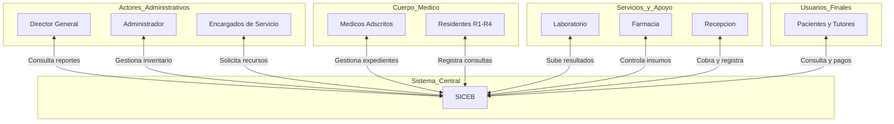

# **Documento de Visión y Alcance**

## **ÍNDICE**

1. [Introducción]
2. [Contexto de negocio]
    - [Antecedentes y problemática]
    - [Necesidades]
    - [Procesos clave del negocio actuales]
3. [Visión de la solución]
    - [Frase de visión]
    - [Procesos clave del negocio futuros]
    - [Funcionalidades de alto nivel del sistema (épicas)]
4. [Alcance del proyecto]
5. [Contexto del sistema]
    - [Resumen de Involucrados]
    - [Entorno de operación]
---

## **1. Introducción**

Este documento presenta la visión y el alcance del **SICEB: "Sistema Integral de Control y Expedientes de Bienestar"**. Su objetivo es establecer un acuerdo inicial con la dirección de la **Red de Clínicas Integrales de Bienestar Privadas** para el desarrollo de un sistema que optimice la gestión de los servicios médicos ofrecidos.

El documento define el contexto de negocio, la problemática actual, las necesidades identificadas, la visión de la solución propuesta, las funcionalidades de alto nivel del sistema y su alcance dividido en entregas incrementales.

---

## **2. Contexto de negocio**

### **Antecedentes y problemática**

La **Red de Clínicas Integrales de Bienestar Privadas** es una organización de salud privada que proporciona diversos servicios médicos especializados en la ciudad. La clínica opera como **institución de enseñanza médica**, atendiendo pacientes mientras forma residentes de especialidades médicas (niveles R1 a R4).

**Servicios médicos ofrecidos:**

1. Consulta general
2. Urgencias
3. Medicina interna
4. Pediatría
5. Ginecología y obstetricia
6. Laboratorio clínico interno
7. Farmacia interna
8. Expediente clínico electrónico (a implementar)
9. Gestión y asignación de personal médico
10. Servicios formativos internos supervisados

**Objetivos de negocio:**

La clínica busca alcanzar los siguientes objetivos estratégicos:

- **Gestión Financiera:** Registrar eficientemente ingresos y egresos por servicio, generar reportes financieros de rentabilidad
- **Gestión de Clientes:** Mantener expedientes digitales centralizados con historial completo de atención
- **Gestión de Inventario:** Control riguroso de insumos médicos, materiales y medicamentos
- **Gestión de Personal:** Control sobre médicos adscritos y residentes, registro de actividades formativas

**Problemática actual:**

Actualmente, la clínica opera con **procesos completamente manuales** que resultan en:

- **Lentitud operativa:** Procesos basados en documentos Word y reuniones presenciales
- **Falta de control de materiales:** No existe visibilidad del inventario total ni del gasto de materiales por servicio
- **Expedientes fragmentados:** Cada servicio mantiene sus propias plantillas en papel, no hay consolidación de información del paciente
- **Gestión ineficiente de personal:** Registro manual de actividades formativas de residentes y adscritos
- **Reportes financieros lentos:** Generación manual de reportes de ingresos y egresos consume tiempo valioso

### **Necesidades**

A continuación se listan las necesidades que tiene la organización y que le permitirían resolver su problemática:

|ID|Descripción de la necesidad|
|---|---|
|NEC-01|Control de material por servicio y material general de la clínica|
|NEC-02|Registro automatizado de insumos solicitados, aprobados y entregados|
|NEC-03|Expediente digital centralizado de clientes/pacientes accesible por todos los servicios médicos|
|NEC-04|Registro de talleres, capacitaciones y actividades formativas para adscritos y residentes|
|NEC-05|Registro de ingresos económicos por servicio y tipo de paciente|
|NEC-06|Registro de egresos económicos por servicio (gastos en insumos, materiales, medicamentos)|
|NEC-07|Generación automatizada de informes financieros de ingresos, egresos y rentabilidad|
|NEC-08|Control de acceso al sistema por usuario con permisos diferenciados por rol|
|NEC-09|Generación de reportes de solicitudes de insumos (historial, estado, frecuencia)|
|NEC-10|Validación de restricciones de residentes según nivel (R1, R2, R3, R4)|
|NEC-11|Control de medicamentos regulados con trazabilidad completa|
|NEC-12|Gestión de descuentos diferenciados para estudiantes (30%) y trabajadores (20%)|

### **Procesos clave del negocio actuales**

Los procesos principales del negocio en su estado actual (AS IS) son los siguientes:

|ID Proceso|Nombre del proceso|Descripción y pasos|
|---|---|---|
|PROC-01|Solicitud de material|**Descripción:** Los encargados de servicio solicitan insumos al administrador general. **Pasos:** 1. Encargado de servicio crea solicitud en formato Word 2. Encargado envía solicitud por correo o entrega física 3. Administrador revisa solicitud manualmente **Problemas:** Lento, sin trazabilidad, sin notificaciones automáticas|
|PROC-02|Aceptar/rechazar solicitud de material|**Descripción:** El administrador aprueba o rechaza solicitudes de insumos. **Pasos:** 1. Administrador revisa solicitud 2. Administrador decide aprobar/rechazar indicando razones 3. Administrador notifica al encargado de forma presencial o por correo **Problemas:** Sin registro histórico, sin alertas de decisión|
|PROC-03|Entregar materiales|**Descripción:** El administrador entrega materiales aprobados. **Pasos:** 1. Administrador contacta al encargado presencialmente 2. Encargado recoge material físicamente 3. Sin registro formal de entrega **Problemas:** Sin comprobante digital, sin trazabilidad de entregas|
|PROC-04|Registrar uso de materiales|**Descripción:** Los encargados registran insumos utilizados con pacientes. **Pasos:** 1. Tras consulta, encargado anota insumos en plantilla Word 2. Plantillas se acumulan sin consolidación **Problemas:** No hay visibilidad en tiempo real del consumo|
|PROC-05|Registro de materiales desechados|**Descripción:** Registro de materiales desechados por caducidad u otros motivos. **Pasos:** 1. Encargado registra en plantilla Word los materiales desechados 2. No hay consolidación ni reportes **Problemas:** Pérdidas no monitoreadas, sin alertas de caducidad|
|PROC-06|Creación de expediente|**Descripción:** Creación de expediente médico para pacientes. **Pasos:** 1. Encargado crea plantilla propia (cada servicio tiene formato diferente) 2. Registro completamente manual 3. Expediente en papel guardado en archivero **Problemas:** No hay consolidación entre servicios, información duplicada o fragmentada|
|PROC-07|Solicitud de taller|**Descripción:** Solicitud de realización de talleres de capacitación. **Pasos:** 1. Encargado solicita reunión presencial con administrador 2. En reunión, expone razones del taller 3. Sin registro formal de la solicitud **Problemas:** Sin historial de solicitudes, sin seguimiento|
|PROC-08|Aceptar/rechazar taller|**Descripción:** Aprobación o rechazo de talleres solicitados. **Pasos:** 1. Tras reunión, administrador notifica decisión de forma presencial 2. Sin registro de razones de aprobación/rechazo **Problemas:** Sin trazabilidad, sin registro de talleres realizados|
|PROC-09|Atención médica|**Descripción:** Atención de pacientes en consulta. **Pasos:** 1. Paciente llega a recepción sin cita previa 2. Recepción registra datos en cuaderno 3. Médico/residente atiende y registra en plantilla 4. Si prescribe medicamentos, paciente va a farmacia 5. Farmacia dispensa sin validación digital de prescripción 6. Cobro en recepción sin sistema automatizado **Problemas:** Sin expediente digital, sin validación de prescripciones, sin control de restricciones de residentes|
|PROC-10|Procesamiento de estudio de laboratorio|**Descripción:** Solicitud y procesamiento de estudios diagnósticos. **Pasos:** 1. Médico entrega orden en papel a paciente 2. Paciente paga en recepción 3. Laboratorio procesa estudio 4. Resultados se entregan en papel 5. Médico archiva resultados en expediente físico **Problemas:** Sin registro digital de resultados, sin trazabilidad de muestras|

---

## **3. Visión de la solución**

### **Frase de visión**

El sistema **SICEB** será una **aplicación web** que automatizará y centralizará la gestión de información relacionada con el modelo de negocio de la **Red de Clínicas Integrales de Bienestar**.

El sistema permitirá:

- Registro y consulta de **expedientes médicos electrónicos consolidados**
- Gestión de **inventarios con alertas automáticas** (materiales, medicamentos, reactivos)
- **Solicitudes y aprobaciones digitalizadas** (insumos, talleres)
- Control de **personal médico con restricciones por nivel** (R1-R4)
- **Reportes financieros automatizados** (ingresos, egresos, rentabilidad)
- **Validaciones críticas** (prescripciones, existencias, supervisión)
- **Trazabilidad completa** (medicamentos controlados, dispensaciones, consultas)

Este sistema deberá **optimizar el tiempo**, **mejorar el control operativo** y **brindar una mejor experiencia** a todos los involucrados (personal administrativo, médicos, residentes, pacientes).

### **Procesos clave del negocio futuros**

Los procesos del negocio después de implementar SICEB (TO BE) son los siguientes:

|ID Proceso|Nombre del proceso|Descripción y pasos|
|---|---|---|
|PROC-01-FUT|Solicitud de material digitalizada|**Descripción:** Solicitud automatizada de insumos. **Pasos:** 1. Encargado accede a SICEB y crea solicitud digital 2. SICEB notifica automáticamente al administrador 3. Solicitud queda registrada con timestamp y trazabilidad **Mejoras:** Trazabilidad completa, notificaciones automáticas, historial consultable|
|PROC-02-FUT|Aprobación digital de solicitudes|**Descripción:** Aprobación/rechazo con registro en sistema. **Pasos:** 1. Administrador revisa solicitud en SICEB 2. Aprueba/rechaza con justificación en sistema 3. SICEB notifica automáticamente al encargado 4. Decisión queda registrada permanentemente **Mejoras:** Registro de razones, notificaciones automáticas, reportes de solicitudes|
|PROC-03-FUT|Entrega digital de materiales|**Descripción:** Registro de entregas con comprobante digital. **Pasos:** 1. Administrador registra entrega en SICEB 2. Encargado confirma recepción en SICEB 3. Inventario se actualiza automáticamente **Mejoras:** Comprobante digital, actualización automática de inventario, trazabilidad|
|PROC-04-FUT|Registro automático de consumo|**Descripción:** Registro de insumos usados en consultas. **Pasos:** 1. Durante/después de consulta, médico registra insumos en SICEB 2. Sistema actualiza inventario en tiempo real 3. Sistema genera alertas si stock baja del mínimo **Mejoras:** Visibilidad en tiempo real, alertas automáticas, cálculo de costos por consulta|
|PROC-06-FUT|Expediente médico electrónico|**Descripción:** Creación y actualización de expediente digital consolidado. **Pasos:** 1. Al registrar paciente nuevo, sistema crea expediente único 2. Cada servicio agrega información al MISMO expediente 3. Expediente es INMUTABLE (no se edita, solo se agregan consultas) 4. Expediente accesible desde cualquier servicio médico **Mejoras:** Consolidación total, no duplicación, historial completo, acceso multi-servicio|
|PROC-09-FUT|Atención médica digitalizada|**Descripción:** Atención con soporte del sistema. **Pasos:** 1. Paciente llega, recepción busca/crea paciente en SICEB 2. Sistema aplica descuento automático según tipo (Est 30%, Trab 20%) 3. Médico/residente accede a expediente completo en SICEB 4. Sistema valida restricciones de residente (R1 no puede prescribir controlados) 5. Si prescribe, farmacia valida prescripción en SICEB antes de dispensar 6. Sistema verifica existencias antes de dispensar 7. Cobro registrado en SICEB con emisión de recibo digital **Mejoras:** Expediente consolidado, validaciones automáticas, control de restricciones, trazabilidad|
|PROC-10-FUT|Procesamiento digital de laboratorio|**Descripción:** Solicitud y registro digital de estudios. **Pasos:** 1. Médico solicita estudio en SICEB 2. Sistema registra solicitud y cobra automáticamente 3. Laboratorio ve solicitudes pendientes en SICEB 4. Laboratorio ingresa resultados (texto) en SICEB 5. Médico consulta resultados en expediente del paciente **Mejoras:** Trazabilidad completa, resultados en expediente, sin pérdida de órdenes|

### **Funcionalidades de alto nivel del sistema (épicas)**

A continuación se listan las funcionalidades de alto nivel (épicas) que tendrá la solución:

|ID|Descripción de la funcionalidad|Prioridad|Proceso de negocio asociado|
|---|---|---|---|
|EP-01|**Autenticación y control de acceso:** El sistema debe permitir que los usuarios accedan mediante credenciales y gestionar usuarios con permisos diferenciados por rol (9 roles definidos)|Alta|Todos|
|EP-02|**Gestión de inventario general:** Administrador visualiza inventario de TODOS los servicios; Encargados ven SOLO su servicio. Incluye alertas de stock bajo, caducidad y temperatura|Alta|PROC-01, PROC-03, PROC-04, PROC-05|
|EP-03|**Solicitud y aprobación de insumos:** Encargados solicitan, Administrador aprueba/rechaza, sistema notifica decisiones, encargados registran recepción|Alta|PROC-01-FUT, PROC-02-FUT, PROC-03-FUT|
|EP-04|**Solicitud y aprobación de talleres:** Encargados/residentes solicitan talleres, Administrador aprueba/rechaza, sistema notifica, se registra asistencia|Alta|PROC-07, PROC-08|
|EP-05|**Registro de pacientes:** Personal administrativo y encargados pueden registrar pacientes con clasificación (Estudiante 30% desc, Trabajador 20% desc, Externo, Menor <18 años)|Alta|PROC-09-FUT|
|EP-06|**Gestión de expedientes médicos:** Creación de expediente ÚNICO por paciente (30+ campos), actualización mediante adición de consultas (INMUTABLES), consulta de historial, búsqueda de pacientes, adjuntos (PDF/imágenes)|Alta|PROC-06-FUT, PROC-09-FUT|
|EP-07|**Gestión de farmacia:** Validación de prescripciones médicas, verificación de existencias, registro de dispensación, control de medicamentos regulados, cobro separado|Alta|PROC-09-FUT|
|EP-08|**Gestión de laboratorio:** Registro de solicitudes de estudios, ingreso de resultados (texto), gestión de reactivos, control de temperatura/caducidad|Alta|PROC-10-FUT|
|EP-09|**Registro de pagos:** Registro de pagos con emisión de recibos simples (NO CFDI en MVP), registro de forma de pago, asignación a paciente|Alta|PROC-09-FUT|
|EP-10|**Reportes financieros:** Generación automática de reportes de ingresos (por servicio, concepto, tipo paciente), egresos (gastos en insumos), rentabilidad, tendencias|Media|Todos|
|EP-11|**Control de personal médico:** Registro de médicos adscritos y residentes (R1-R4), validación automática de restricciones por nivel, registro de actividades formativas (NO evaluaciones académicas)|Alta|PROC-09-FUT|
|EP-12|**Gestión de uso de materiales:** Registro de insumos utilizados en consultas, actualización automática de inventario, generación de alertas|Media|PROC-04-FUT|
|EP-13|**Sistema de notificaciones:** Notificaciones automáticas de solicitudes creadas/aprobadas/rechazadas, alertas de inventario (stock, caducidad, temperatura)|Media|PROC-01-FUT, PROC-02-FUT, EP-02|
|EP-14|**Seguridad y multitenencia:** Implementar esquema de seguridad que permita acceso segmentado (cada servicio ve solo SU información), excepto Director y Administrador|Alta|Todos|
|EP-15|**Historial y reportes de operaciones:** Consulta de historial de solicitudes (insumos/talleres), reportes de materiales desechados, reportes de pacientes atendidos|Media|Todos|

---

## **4. Alcance del proyecto**

El proyecto se desarrollará en **10 entregas incrementales**, priorizando funcionalidades que aporten mayor valor al negocio:

|Número de entrega|Tema principal|ID de épicas a incluir|
|---|---|---|
|**Entrega 1.0**|Acceso y seguridad base|EP-01|
|**Entrega 2.0**|Inventario y consulta básica|EP-02 (parcial: consulta inventario)|
|**Entrega 3.0**|Solicitud de insumos|EP-03, EP-13 (notificaciones de insumos)|
|**Entrega 4.0**|Solicitud de talleres|EP-04, EP-13 (notificaciones de talleres)|
|**Entrega 5.0**|Registro de pacientes|EP-05|
|**Entrega 6.0**|Expedientes médicos (core)|EP-06, EP-11 (registro de personal)|
|**Entrega 7.0**|Farmacia y laboratorio|EP-07, EP-08|
|**Entrega 8.0**|Pagos y reportes básicos|EP-09, EP-10 (parcial: reportes básicos)|
|**Entrega 9.0**|Uso de materiales e inventario completo|EP-12, EP-02 (completo con alertas)|
|**Entrega 10.0**|Reportes avanzados y seguridad final|EP-10 (completo), EP-14, EP-15|

**Limitaciones del alcance:**

- ❌ **NO se incluye facturación electrónica CFDI** en MVP (versión 1.0). Se emiten únicamente recibos simples. CFDI se planea para versión 2.0 futura.
- ❌ **NO se incluyen aplicaciones móviles** en MVP. El sistema será únicamente web responsive.
- ❌ **NO se incluyen integraciones con sistemas externos** (sistemas académicos, otros hospitales, etc.).
- ❌ **NO se incluye telemedicina** (consultas virtuales).
- ❌ **NO se incluyen evaluaciones académicas** de residentes, solo registro de participación en actividades.

---

## **5. Contexto del sistema**

### **Resumen de Involucrados**

A continuación se listan las personas que tienen participación en relación al desarrollo y operación del sistema:

| Nombre                                  | Descripción                                                                                                | Responsabilidades                                                                                                                                                                                                                                                                                 |
| --------------------------------------- | ---------------------------------------------------------------------------------------------------------- | ------------------------------------------------------------------------------------------------------------------------------------------------------------------------------------------------------------------------------------------------------------------------------------------------- |
| **Director General**                    | Director de la Red de Clínicas Integrales de Bienestar                                                     | • Supervisa operaciones estratégicas de la clínica • Revisa reportes ejecutivos y financieros generados por SICEB • Autoriza decisiones de alto nivel • Tiene acceso a TODA la información de TODOS los servicios                                                                     |
| **Administrador General**               | Responsable de gestión administrativa y operativa                                                          | • Aprueba/rechaza solicitudes de insumos y talleres • Gestiona inventario general de todos los servicios • Genera reportes administrativos • Registra entregas de materiales • Recibe notificaciones de nuevas solicitudes • Tiene acceso a inventario de TODOS los servicios |
| **Encargados de Servicio**              | Coordinadores de servicios médicos (Consulta Gral, Pediatría, Ginecología, etc.)                           | • Solicitan insumos para SU servicio • Solicitan talleres de capacitación • Registran uso de materiales en consultas • Gestionan expedientes médicos de pacientes • Consultan inventario de SU servicio únicamente • Reciben notificaciones de aprobaciones/rechazos          |
| **Médicos Adscritos**                   | Médicos especialistas con título, personal senior                                                          | • Atienden pacientes autónomamente • Registran consultas y diagnósticos en expedientes • Prescriben medicamentos (incluye controlados) • Solicitan estudios de laboratorio • Supervisan actividades de residentes • NO tienen restricciones en el sistema                     |
| **Residentes R4**                       | Médicos en 4to año de especialidad                                                                         | • Prácticamente autónomos • Realizan procedimientos complejos • Prescriben medicamentos controlados • Supervisan residentes R1, R2 y R3 • Participan en talleres formativos                                                                                                       |
| **Residentes R3**                       | Médicos en 3er año de especialidad                                                                         | • Realizan consultas sin supervisión • Procedimientos menores • Prescriben medicamentos básicos (NO controlados) • Supervisan residentes R1 y R2 • Sistema valida restricciones de nivel R3                                                                                       |
| **Residentes R2**                       | Médicos en 2do año de especialidad                                                                         | • Consultas con supervisión ocasional • Procedimientos básicos • Prescripción limitada de medicamentos • Sistema valida restricciones de nivel R2                                                                                                                                     |
| **Residentes R1**                       | Médicos en 1er año de especialidad                                                                         | • Solo consultas BAJO SUPERVISIÓN obligatoria • NO puede prescribir medicamentos controlados • Procedimientos muy básicos • Sistema BLOQUEA acciones restringidas para R1                                                                                                             |
| **Personal de Laboratorio**             | Técnicos especializados en procesamiento de estudios                                                       | • Registran solicitudes de estudios recibidas • Procesan estudios diagnósticos • Ingresan resultados en formato texto • Gestionan inventario de reactivos • Registran control de temperatura de reactivos                                                                         |
| **Personal de Farmacia**                | Farmacéuticos y auxiliares de farmacia                                                                     | • Dispensan medicamentos prescritos • Validan prescripciones médicas en sistema • Verifican existencias antes de dispensar • Registran control de medicamentos regulados • Cobran medicamentos (separado de consulta)                                                             |
| **Personal Administrativo / Recepción** | Personal de recepción y soporte administrativo                                                             | • Registran pacientes nuevos en sistema • Gestionan citas médicas • Procesan pagos de consultas • Emiten recibos de pago • Atienden solicitudes ARCO de pacientes • Sistema aplica descuentos automáticamente                                                                 |
| **Pacientes**                           | Usuarios finales de servicios médicos (Estudiantes 30% desc, Trabajadores 20% desc, Externos, Menores <18) | • Reciben atención médica • Proporcionan información personal y médica • Pueden solicitar acceso a su expediente (derechos ARCO) • Firman consentimientos informados                                                                                                                  |

### **Entorno de operación**

#### **Diagrama de Contexto del Sistema**

 
