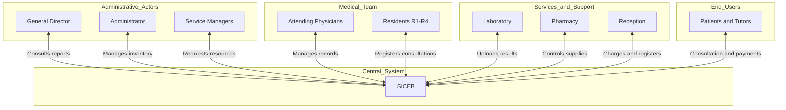

# **Vision and Scope Document**

## **INDEX**

1. [Introduction]
2. [Business Context]
    - [Background and Problem Statement]
    - [Needs]
    - [Current Key Business Processes]
3. [Solution Vision]
    - [Vision Statement]
    - [Future Key Business Processes]
    - [High-Level System Functionalities (Epics)]
4. [Project Scope]
5. [System Context]
    - [Stakeholder Summary]
    - [Operating Environment]
---

## **1. Introduction**

This document presents the vision and scope of **SICEB: "Comprehensive Wellness Control and Records System"** (Sistema Integral de Control y Expedientes de Bienestar). Its objective is to establish an initial agreement with the direction of the **Private Wellness Integrated Clinics Network** for the development of a system that optimizes the management of the medical services offered.

The document defines the business context, the current problem, the identified needs, the vision of the proposed solution, the high-level functionalities of the system, and its scope divided into incremental deliveries.

---

## **2. Business Context**

### **Background and Problem Statement**

The **Private Wellness Integrated Clinics Network** is a private health organization that provides various specialized medical services in the city. The clinic operates as a **medical teaching institution**, attending to patients while training medical residents (levels R1 to R4).

**Medical Services Offered:**

1. General Consultation
2. Emergencies
3. Internal Medicine
4. Pediatrics
5. Gynecology and Obstetrics
6. Internal Clinical Laboratory
7. Internal Pharmacy
8. Electronic Clinical Record (to be implemented)
9. Management and assignment of medical personnel
10. Supervised internal training services

**Business Objectives:**

The clinic seeks to achieve the following strategic objectives:

- **Financial Management:** Efficiently record income and expenses per service, generate financial profitability reports.
- **Client Management:** Maintain centralized digital records with complete care history.
- **Inventory Management:** Rigorous control of medical supplies, materials, and medications.
- **Personnel Management:** Control over attending physicians and residents, registration of training activities.

**Current Problem:**

Currently, the clinic operates with **completely manual processes** that result in:

- **Operational Slowness:** Processes based on Word documents and face-to-face meetings.
- **Lack of Material Control:** No visibility of total inventory or material expenditure per service.
- **Fragmented Records:** Each service maintains its own paper templates; there is no consolidation of patient information.
- **Inefficient Personnel Management:** Manual registration of training activities for residents and attending physicians.
- **Slow Financial Reports:** Manual generation of income and expense reports consumes valuable time.

### **Needs**

Below are the needs that the organization has and that would allow it to solve its problems:

|ID|Description of the Need|
|---|---|
|NEC-01|Control of material per service and general clinic material|
|NEC-02|Automated registration of requested, approved, and delivered supplies|
|NEC-03|Centralized digital client/patient record accessible by all medical services|
|NEC-04|Registration of workshops, trainings, and training activities for attending physicians and residents|
|NEC-05|Registration of economic income by service and patient type|
|NEC-06|Registration of economic expenses by service (expenses on supplies, materials, medications)|
|NEC-07|Automated generation of financial reports of income, expenses, and profitability|
|NEC-08|System access control by user with permissions differentiated by role|
|NEC-09|Generation of supply request reports (history, status, frequency)|
|NEC-10|Validation of resident restrictions according to level (R1, R2, R3, R4)|
|NEC-11|Control of regulated medications with complete traceability|
|NEC-12|Management of differentiated discounts for students (30%) and workers (20%)|

### **Current Key Business Processes**

The main business processes in their current state (AS IS) are as follows:

|Process ID|Process Name|Description and Steps|
|---|---|---|
|PROC-01|Material Request|**Description:** Service managers request supplies from the general administrator. **Steps:** 1. Service manager creates request in Word format 2. Manager sends request by email or physical delivery 3. Administrator reviews request manually **Problems:** Slow, no traceability, no automatic notifications|
|PROC-02|Approve/Reject Material Request|**Description:** The administrator approves or rejects supply requests. **Steps:** 1. Administrator reviews request 2. Administrator decides to approve/reject indicating reasons 3. Administrator notifies the manager in person or by email **Problems:** No historical record, no decision alerts|
|PROC-03|Deliver Materials|**Description:** The administrator delivers approved materials. **Steps:** 1. Administrator contacts the manager in person 2. Manager physically picks up material 3. No formal delivery record **Problems:** No digital receipt, no delivery traceability|
|PROC-04|Register Material Usage|**Description:** Managers register supplies used with patients. **Steps:** 1. After consultation, manager notes supplies in Word template 2. Templates accumulate without consolidation **Problems:** No real-time visibility of consumption|
|PROC-05|Register Discarded Materials|**Description:** Registration of materials discarded due to expiration or other reasons. **Steps:** 1. Manager records discarded materials in Word template 2. No consolidation or reports **Problems:** Unmonitored losses, no expiration alerts|
|PROC-06|Record Creation|**Description:** Creation of medical record for patients. **Steps:** 1. Manager creates own template (each service has different format) 2. Completely manual registration 3. Paper record stored in filing cabinet **Problems:** No consolidation between services, duplicate or fragmented information|
|PROC-07|Workshop Request|**Description:** Request to hold training workshops. **Steps:** 1. Manager requests face-to-face meeting with administrator 2. In meeting, explains reasons for the workshop 3. No formal request record **Problems:** No request history, no follow-up|
|PROC-08|Approve/Reject Workshop|**Description:** Approval or rejection of requested workshops. **Steps:** 1. After meeting, administrator notifies decision within person 2. No record of approval/rejection reasons **Problems:** No traceability, no record of workshops held|
|PROC-09|Medical Attention|**Description:** Patient care in consultation. **Steps:** 1. Patient arrives at reception without prior appointment 2. Reception records data in notebook 3. Physician/resident attends and records in template 4. If medication prescribed, patient goes to pharmacy 5. Pharmacy dispenses without digital prescription validation 6. Payment at reception without automated system **Problems:** No digital record, no prescription validation, no resident restriction control|
|PROC-10|Lab Study Processing|**Description:** Request and processing of diagnostic studies. **Steps:** 1. Physician gives paper order to patient 2. Patient pays at reception 3. Lab processes study 4. Results delivered on paper 5. Physician files results in physical record **Problems:** No digital result record, no sample traceability|

---

## **3. Solution Vision**

### **Vision Statement**

The **SICEB** system will be a **web application** that will automate and centralize the management of information related to the business model of the **Wellness Integrated Clinics Network**.

The system will allow:

- Registration and consultation of **consolidated electronic medical records**
- Management of **inventories with automatic alerts** (materials, medications, reagents)
- **Digitized requests and approvals** (supplies, workshops)
- Control of **medical personnel with level restrictions** (R1-R4)
- **Automated financial reports** (income, expenses, profitability)
- **Critical validations** (prescriptions, stock, supervision)
- **Complete traceability** (controlled medications, dispensations, consultations)

This system should **optimize time**, **improve operational control**, and **provide a better experience** to all involved (administrative staff, physicians, residents, patients).

### **Future Key Business Processes**

The business processes after implementing SICEB (TO BE) are as follows:

|Process ID|Process Name|Description and Steps|
|---|---|---|
|PROC-01-FUT|Digitized Material Request|**Description:** Automated supply request. **Steps:** 1. Manager accesses SICEB and creates digital request 2. SICEB automatically notifies the administrator 3. Request is recorded with timestamp and traceability **Improvements:** Complete traceability, automatic notifications, searchable history|
|PROC-02-FUT|Digital Approval of Requests|**Description:** Approval/rejection with system record. **Steps:** 1. Administrator reviews request in SICEB 2. Approves/rejects with justification in system 3. SICEB automatically notifies the manager 4. Decision is permanently recorded **Improvements:** Reason recording, automatic notifications, request reports|
|PROC-03-FUT|Digital Material Delivery|**Description:** Delivery registration with digital receipt. **Steps:** 1. Administrator records delivery in SICEB 2. Manager confirms receipt in SICEB 3. Inventory updates automatically **Improvements:** Digital receipt, automatic inventory update, traceability|
|PROC-04-FUT|Automatic Consumption Registration|**Description:** Registration of supplies used in consultations. **Steps:** 1. During/after consultation, physician registers supplies in SICEB 2. System updates inventory in real time 3. System generates alerts if stock drops below minimum **Improvements:** Real-time visibility, automatic alerts, cost calculation per consultation|
|PROC-06-FUT|Electronic Medical Record|**Description:** Creation and update of consolidated digital record. **Steps:** 1. Upon registering new patient, system creates unique record 2. Each service adds information to the SAME record 3. Record is IMMUTABLE (cannot be edited, only consultations added) 4. Record accessible from any medical service **Improvements:** Total consolidation, no duplication, complete history, multi-service access|
|PROC-09-FUT|Digitized Medical Attention|**Description:** Care with system support. **Steps:** 1. Patient arrives, reception searches/creates patient in SICEB 2. System applies automatic discount by type (Stu 30%, Work 20%) 3. Physician/resident accesses complete record in SICEB 4. System validates resident restrictions (R1 cannot prescribe controlled meds) 5. If prescribed, pharmacy validates prescription in SICEB before dispensing 6. System verifies stock before dispensing 7. Payment recorded in SICEB with digital receipt issuance **Improvements:** Consolidated record, automatic validations, restriction control, traceability|
|PROC-10-FUT|Digital Lab Processing|**Description:** Request and digital registration of studies. **Steps:** 1. Physician requests study in SICEB 2. System registers request and charges automatically 3. Lab sees pending requests in SICEB 4. Lab enters results (text) in SICEB 5. Physician consults results in patient record **Improvements:** Complete traceability, results in record, no lost orders|

### **High-Level System Functionalities (Epics)**

Below are the high-level functionalities (epics) that the solution will have:

|ID|Functionality Description|Priority|Associated Business Process|
|---|---|---|---|
|EP-01|**Authentication and Access Control:** The system must allow users to access via credentials and manage users with permissions differentiated by role (9 defined roles)|High|All|
|EP-02|**General Inventory Management:** Administrator views inventory of ALL services; Managers see ONLY their service. Includes low stock, expiration, and temperature alerts|High|PROC-01, PROC-03, PROC-04, PROC-05|
|EP-03|**Supply Request and Approval:** Managers request, Administrator approves/rejects, system notifies decisions, managers register receipt|High|PROC-01-FUT, PROC-02-FUT, PROC-03-FUT|
|EP-04|**Workshop Request and Approval:** Managers/residents request workshops, Administrator approves/rejects, system notifies, attendance is recorded|High|PROC-07, PROC-08|
|EP-05|**Patient Registration:** Administrative staff and managers can register patients with classification (Student 30% disc, Worker 20% disc, External, Minor <18 years)|High|PROC-09-FUT|
|EP-06|**Medical Record Management:** Creation of UNIQUE record per patient (30+ fields), update via addition of consultations (IMMUTABLE), history consultation, patient search, attachments (PDF/images)|High|PROC-06-FUT, PROC-09-FUT|
|EP-07|**Pharmacy Management:** Validation of medical prescriptions, stock verification, dispensation registration, controlled medication control, separate payment|High|PROC-09-FUT|
|EP-08|**Laboratory Management:** Registration of study requests, result entry (text), reagent management, temperature/expiration control|High|PROC-10-FUT|
|EP-09|**Payment Registration:** Registration of payments with issuance of simple receipts (NO CFDI in MVP), payment method registration, assignment to patient|High|PROC-09-FUT|
|EP-10|**Financial Reports:** Automatic generation of income reports (by service, concept, patient type), expenses (supply costs), profitability, trends|Medium|Todos|
|EP-11|**Medical Personnel Control:** Registration of attending physicians and residents (R1-R4), automatic validation of level restrictions, registration of training activities (NO academic evaluations)|High|PROC-09-FUT|
|EP-12|**Material Usage Management:** Registration of supplies used in consultations, automatic inventory update, alert generation|Medium|PROC-04-FUT|
|EP-13|**Notification System:** Automatic notifications of requests created/approved/rejected, inventory alerts (stock, expiration, temperature)|Medium|PROC-01-FUT, PROC-02-FUT, EP-02|
|EP-14|**Security and Multi-tenancy:** Implement security scheme that allows segmented access (each service sees only THEIR information), except Director and Administrator|High|All|
|EP-15|**History and Operations Reports:** Consultation of request history (supplies/workshops), discarded material reports, attended patient reports|Medium|All|

---

## **4. Project Scope**

The project will be developed in **10 incremental deliveries**, prioritizing functionalities that add the most value to the business:

|Delivery Number|Main Topic|Epics IDs to Include|
|---|---|---|
|**Delivery 1.0**|Access and base security|EP-01|
|**Delivery 2.0**|Inventory and basic consultation|EP-02 (partial: inventory consultation)|
|**Delivery 3.0**|Supply request|EP-03, EP-13 (supply notifications)|
|**Delivery 4.0**|Workshop request|EP-04, EP-13 (workshop notifications)|
|**Delivery 5.0**|Patient registration|EP-05|
|**Delivery 6.0**|Medical records (core)|EP-06, EP-11 (personnel registration)|
|**Delivery 7.0**|Pharmacy and Laboratory|EP-07, EP-08|
|**Delivery 8.0**|Payments and basic reports|EP-09, EP-10 (partial: basic reports)|
|**Delivery 9.0**|Material usage and complete inventory|EP-12, EP-02 (complete with alerts)|
|**Delivery 10.0**|Advanced reports and final security|EP-10 (complete), EP-14, EP-15|

**Scope Limitations:**

- ❌ **NO electronic billing (CFDI) included** in MVP (version 1.0). Only simple receipts are emitted. CFDI is planned for future version 2.0.
- ❌ **NO mobile applications included** in MVP. The system will be solely responsive web.
- ❌ **NO integrations with external systems included** (academic systems, other hospitals, etc.).
- ❌ **NO telemedicine included** (virtual consultations).
- ❌ **NO academic evaluations included** for residents, only participation registration in activities.

---

## **5. System Context**

### **Stakeholder Summary**

Below are the people who participate in relation to the development and operation of the system:

| Name | Description | Responsibilities |
| --- | --- | --- |
| **General Director** | Director of the Wellness Integrated Clinics Network | • Supervises strategic clinic operations • Reviews executive and financial reports generated by SICEB • Authorizes high-level decisions • Has access to ALL information of ALL services |
| **General Administrator** | Responsible for administrative and operational management | • Approves/rejects supply and workshop requests • Manages general inventory of all services • Generates administrative reports • Registers material deliveries • Receives notifications of new requests • Has access to inventory of ALL services |
| **Service Managers** | Coordinators of medical services (General Consultation, Pediatrics, Gynecology, etc.) | • Request supplies for THEIR service • Request training workshops • Register material usage in consultations • Manage patient medical records • Consult inventory of THEIR service only • Receive notifications of approvals/rejections |
| **Attending Physicians** | Specialist physicians with degree, senior staff | • Attend patients autonomously • Register consultations and diagnoses in records • Prescribe medications (includes controlled) • Request laboratory studies • Supervise resident activities • Do NOT have restrictions in the system |
| **Residents R4** | Physicians in 4th year of specialty | • Practically autonomous • Perform complex procedures • Prescribe controlled medications • Supervise R1, R2, and R3 residents • Participate in training workshops |
| **Residents R3** | Physicians in 3rd year of specialty | • Perform consultations without supervision • Minor procedures • Prescribe basic medications (NOT controlled) • Supervise R1 and R2 residents • System validates R3 level restrictions |
| **Residents R2** | Physicians in 2nd year of specialty | • Consultations with occasional supervision • Basic procedures • Limited medication prescription • System validates R2 level restrictions |
| **Residents R1** | Physicians in 1st year of specialty | • Consultations ONLY UNDER MANDATORY SUPERVISION • Can NOT prescribe controlled medications • Very basic procedures • System BLOCKS restricted actions for R1 |
| **Lab Personnel** | Specialized technicians in study processing | • Register received study requests • Process diagnostic studies • Enter results in text format • Manage reagent inventory • Register reagent temperature control |
| **Pharmacy Personnel** | Pharmacists and pharmacy assistants | • Dispense prescribed medications • Validate medical prescriptions in system • Verify stock before dispensing • Register controlled medication control • Charge for medications (separate from consultation) |
| **Admin / Reception Staff** | Reception and administrative support staff | • Register new patients in system • Manage medical appointments • Process consultation payments • Issue payment receipts • Attend patient ARCO requests • System applies automatic discounts |
| **Patients** | End users of medical services (Students 30% disc, Workers 20% disc, External, Minors <18) | • Receive medical care • Provide personal and medical information • Can request access to their record (ARCO rights) • Sign informed consents |

### **Operating Environment**

#### **System Context Diagram**

